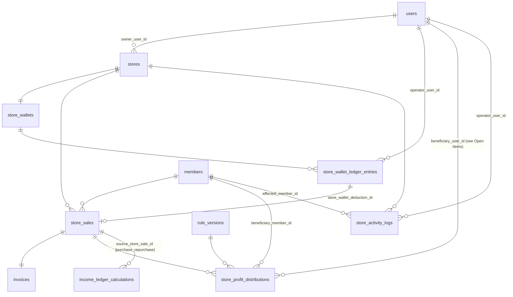

# Data Model

## Status

- Status: Active — implemented. 16 GoldWave domain migrations from T-002, 5 more from T-003, 1 more from T-006, 1 more from T-007 (`database/migrations/2026_09_09_2203*` through `*_2203_50*`, then `2026_09_12_0900*`, then `2026_09_13_100001`, then `2026_09_13_140001`).
- Last verified against migrations / schema: 13-09-2026 — `php artisan migrate` ran clean against the local `goldwave` PostgreSQL database; `php artisan test` (88/88, SQLite) still passes.
- Canonical implementation source: designed directly against `DOMAIN_LOGIC.md` (this file is now the as-built record, not a pre-code blueprint). Update this file in the same change as any future migration.

Database: **PostgreSQL**. Framework: **Laravel** (Eloquent). Table names below are the actual implemented tables — this file is not aspirational.

**Design approach (user's explicit call, 10-09-2026):** the full schema was designed and migrated in one pass, before any business-logic/UI task, instead of module-by-module — because `DOMAIN_LOGIC.md` already fully specifies the business rules (no discovery phase remains), doing it once avoids repeated `ALTER TABLE` churn on cross-cutting tables like the wallet ledger. Later tasks (T-003 onward) build services/UI against this schema; only genuinely new columns discovered during implementation should require a follow-up migration.

## Data Conventions

| Concern                     | Decision                                                                                                                                                                                                                                                                                                                                  |
| --------------------------- | ----------------------------------------------------------------------------------------------------------------------------------------------------------------------------------------------------------------------------------------------------------------------------------------------------------------------------------------- |
| Primary keys                | Auto-incrementing `bigint` (`$table->id()`) on every table. Members are additionally customer-facing via the `members.customer_id` (`GWL01…`) business identifier — unique, never recycled, not the PK.                                                                                                                                   |
| Timestamps / soft deletion  | `created_at`/`updated_at` on every table. **No soft-deletes anywhere** — no entity in `DOMAIN_LOGIC.md` is ever deleted, only status-transitioned (§18 Status Models); deleting a `members` row would also corrupt the `sponsor_id`/`placement_parent_id` chains of every descendant, so status columns are the only lifecycle mechanism. |
| Time zone                   | **`Asia/Kolkata`** — decided during T-002 (`config/app.php` `timezone`, `.env` `APP_TIMEZONE`). Necessary before the 15th 12:00 AM / 12:00 PM draw schedule (`DOMAIN_LOGIC.md` §8) and daily dummy-entry job can be wired correctly.                                                                                                      |
| Money / precision           | `decimal(14,2)` on every money column (rupees, 2 decimal places) — never `float`. Percentages/rates use `decimal(6,3)` (supports values like `0.25`, `0.5`, `5.000`).                                                                                                                                                                     |
| Tenant / ownership boundary | Store-scoped for Admin/Store Owner role (`stores.owner_user_id`); company-wide for Super Admin. See `DOMAIN_LOGIC.md` §2, §17.                                                                                                                                                                                                            |
| Audit / retention           | Financial tables are append-only ledgers (`wallet_ledger_entries`, `store_wallet_ledger_entries`, `income_ledger_calculations`, `store_profit_distributions`, `payout_transactions`) — rows are never updated after creation, only new correction rows are added. See `DOMAIN_LOGIC.md` §22 and `SECURITY.md`.                            |
| Versioned settings          | All Super-Admin-configurable rates/thresholds/taxes (`DOMAIN_LOGIC.md` §7.4) live in `rule_versions` (a publishable version header) + `rule_values` (one JSON blob per config key against that version), instead of one normalized table per config type. Every calculation row stores the `rule_version_id` it used.                     |

## Implemented Tables

Grouped by migration file (`database/migrations/`). Column-level detail and the reasoning behind each design choice is documented as comments inside each migration file itself — read those, not just this summary, before altering a table.

| Migration                              | Tables                                                                                                                                                 | Canonical business rule               |
| -------------------------------------- | ------------------------------------------------------------------------------------------------------------------------------------------------------ | ------------------------------------- |
| `add_role_to_users_table`              | `users.role` (enum: member/admin/super_admin) added                                                                                                    | `DOMAIN_LOGIC.md` §2                  |
| `create_metal_rates_table`             | `metal_rates`                                                                                                                                          | §5 (Gold & Silver Rate Settings, S07) |
| `create_stores_tables`                 | `stores`, `store_wallets`, `store_wallet_ledger_entries`                                                                                               | §16.1                                 |
| `create_membership_plans_table`        | `membership_plans` (5 plans A–E; `product_category` nullable — see Open Items below for a pending Plan F/rate-booking schema change, not yet migrated) | §3                                    |
| `create_rule_versions_tables`          | `rule_versions`, `rule_values`                                                                                                                         | §7.4, §18.2, §22                      |
| `create_members_table`                 | `members` (sponsor/placement chains, dummy-entry fields, pending-profile fields, cached wallet balance)                                                | §0, §4, §13, §14                      |
| `create_member_bank_details_table`     | `member_bank_details`                                                                                                                                  | §11.2                                 |
| `create_profile_change_requests_table` | `profile_change_requests`                                                                                                                              | §13.2                                 |
| `create_emi_and_payments_tables`       | `payments`, `emi_schedules`, `emi_installments`, `product_benefits`                                                                                    | §5, §10                               |
| `create_income_tables`                 | `income_ledger_calculations` (Level Income + Purchase/Repurchase, one shape), `pair_entries`, `pair_reward_transactions`                               | §6, §7, §15                           |
| `adjust_income_ledger_calculations_for_level_income` (T-006)  | `beneficiary_member_id` relaxed to nullable (a `chain_too_short` skipped row has no member to attach); unique `(source_payment_id, level_no)` added   | §6, §21                               |
| `add_pair_entries_idempotency_unique` (T-007)  | `pair_entries` gains unique `(source_payment_id, member_id)` — one fan-out row per (qualifying joining, ancestor)                                     | §7, §21                               |
| `create_wallet_ledger_entries_table`   | `wallet_ledger_entries` (polymorphic `source`)                                                                                                         | §12                                   |
| `create_payout_tables`                 | `payout_requests`, `payout_transactions`                                                                                                               | §11                                   |
| `create_draw_tables`                   | `draw_groups`, `draw_group_members`, `draw_group_month_configs`, `draw_executions`                                                                     | §8                                    |
| `create_booster_tables`                | `booster_qualifications`, `booster_payout_schedules`                                                                                                   | §9                                    |
| `create_store_sales_tables`            | `store_sales`, `invoices`, `store_profit_distributions` (+ deferred FK back onto `income_ledger_calculations`)                                         | §15, §16.2, §16.4                     |
| `create_store_activity_logs_table`     | `store_activity_logs` (polymorphic `affected_reference`)                                                                                               | §16.3                                 |

Plus the Laravel starter kit's own tables (unchanged, `users` gains `mobile` — see below): `users`, `cache`, `cache_locks`, `sessions`, `jobs`, `job_batches`, `failed_jobs`, `passkeys`, `password_reset_tokens`, `migrations`.

### T-003 additions (registration + login)

| Migration                                    | Change                                                                                                                                                                                                                          | Canonical business rule                                    |
| -------------------------------------------- | ------------------------------------------------------------------------------------------------------------------------------------------------------------------------------------------------------------------------------- | ---------------------------------------------------------- |
| `add_mobile_to_users_table`                  | `users.mobile` (nullable, unique)                                                                                                                                                                                               | §2.1                                                       |
| `create_otp_codes_table`                     | `otp_codes` (identifier/channel/purpose/code_hash/attempts/expires_at/consumed_at)                                                                                                                                              | §2.2                                                       |
| `adjust_members_table_for_registration_flow` | `members.customer_id` relaxed to nullable; `members_placement_unique` constraint on `(placement_parent_id, placement_side)`                                                                                                     | §2.1/§3.1 (Customer ID timing), §4.3 (one member per slot) |
| `add_rate_booking_columns`                   | `membership_plans.fixed_weight_grams`; `emi_schedules.rate_booking_method`/`installment_amount`/`metal_rate_id`/`rate_per_gram_at_booking`/`fixed_weight_grams`/`maintenance_cost`/`rule_version_id`/`future_commitment_amount` | §3, §3.0                                                   |
| `create_customer_id_counter_table`           | `customer_id_counters` (single locked counter row — a native Postgres `SEQUENCE` was rejected since it isn't portable to the SQLite test database; see the migration's own comment)                                             | §3.2                                                       |

## Logical Data Relationship Blueprint (as implemented)

```
Member (sponsor_id) → Sponsor Member                (self-referencing; independent of placement)
Member (placement_parent_id + placement_side) → Placement Parent   (self-referencing; independent of sponsor)
Member → Membership Plan
Member → EMI Schedule → EMI Installment → Payment
Payment → Income Ledger Calculation (type=level_income)
Pair Entry (source_payment_id) → Pair Reward Transaction (consumption-tracked)
Member → Wallet Ledger Entry (polymorphic source) → Payout Request → Payout Transaction
Draw Group → Draw Group Member / Draw Group Month Config → Draw Execution (winner + upline benefit)
Member → Booster Qualification → Booster Payout Schedule (3 rows)
Member → Profile Change Request
Member (is_company_dummy) → dummy_status / dummy_assigned_by (same row converts into the leader's identity — no separate table)
Store → Store Wallet → Store Wallet Ledger Entry (advance/topup/deduction)
Store → Store Sale (transaction_type: new_sale/purchase/repurchase) → Invoice
Store Sale → Store Profit Distribution (owner + 3 Sponsor/Direct levels) — see Open Items below
Store Sale → Income Ledger Calculation (type=purchase_repurchase) — see Open Items below
Store → Store Activity Log (polymorphic affected_reference)
Rule Version → Rule Values (versioned settings) ← referenced by every calculation table
```

## Entity-Relationship Diagram

Split into two diagrams for legibility (member/compensation core, and the store module) — both are the same schema described in prose above, just visualized. Cardinality: `||--o{` = one-to-many, `||--o|` = one-to-zero-or-one, `||--||` = one-to-one.

### Member, Compensation & Payout Core

```mermaid
erDiagram
    users ||--o| members : "user_id (role=member)"
    members ||--o{ members : "sponsor_id (self)"
    members ||--o{ members : "placement_parent_id (self)"
    membership_plans ||--o{ members : "membership_plan_id"
    users ||--o{ members : "activated_by / dummy_assigned_by"

    members ||--o{ emi_schedules : ""
    membership_plans ||--o{ emi_schedules : ""
    emi_schedules ||--o{ emi_installments : ""
    payments ||--o{ emi_installments : "payment_id"
    members ||--o{ payments : ""

    members ||--o{ product_benefits : ""
    membership_plans ||--o{ product_benefits : ""
    metal_rates ||--o{ product_benefits : ""

    payments ||--o{ income_ledger_calculations : "source_payment_id (level_income)"
    members ||--o{ income_ledger_calculations : "beneficiary_member_id"
    rule_versions ||--o{ income_ledger_calculations : ""

    payments ||--o{ pair_entries : "source_payment_id"
    members ||--o{ pair_entries : ""
    members ||--o{ pair_reward_transactions : ""
    rule_versions ||--o{ pair_reward_transactions : ""

    members ||--o{ wallet_ledger_entries : ""
    members ||--o{ member_bank_details : ""
    members ||--o{ payout_requests : ""
    member_bank_details ||--o{ payout_requests : ""
    wallet_ledger_entries ||--o| payout_requests : "hold_ledger_entry_id"
    payout_requests ||--o{ payout_transactions : ""
    users ||--o{ payout_transactions : "processed_by"

    members ||--o{ profile_change_requests : ""
    users ||--o{ profile_change_requests : "reviewed_by"

    members ||--o{ booster_qualifications : ""
    rule_versions ||--o{ booster_qualifications : ""
    booster_qualifications ||--o{ booster_payout_schedules : ""
    wallet_ledger_entries ||--o| booster_payout_schedules : ""

    draw_groups ||--o{ draw_group_members : ""
    members ||--o{ draw_group_members : ""
    draw_groups ||--o{ draw_group_month_configs : ""
    draw_groups ||--o{ draw_executions : ""
    members ||--o{ draw_executions : "winner_member_id / upline_benefit_member_id"

    rule_versions ||--o{ rule_values : ""
```



### Store Module



## Open Items Discovered While Designing the Schema

- **RESOLVED (12-09-2026 — user confirmation):** Store Profit Distribution vs. Purchase/Repurchase Upline Income co-application — see `DOMAIN_LOGIC.md` §16.4/§21. Both fire together on a member's store purchase; Store Profit Distribution alone fires on a walk-in/non-member sale or a new-joining-with-jewellery-delivery. The existing schema (`store_profit_distributions` and `income_ledger_calculations` both referencing `store_sales`) already supports this without a migration change — safe to build the business-logic service once T-014 starts (with the user's go-ahead).
- **RESOLVED (12-09-2026 — user confirmation):** Store Owner beneficiary identity — a Store Owner **is** also a full network Member (own Customer ID, sponsor/placement, wallet). `store_profit_distributions.beneficiary_member_id` (already present, nullable) is the field to populate for the Store Owner's 2% share going forward — `wallet_ledger_entries.member_id` (NOT NULL) can be credited directly since the beneficiary is always a `members` row. `beneficiary_user_id` may still be worth keeping for non-member store-operation audit trail purposes, but is no longer required to represent the Store Owner's compensation share.
- **RESOLVED (12-09-2026 — T-003):** the client's updated spec's new Plan D (₹10,000 × 10 months, 10gm Gold) and mandatory Current-Rate-Booking-vs-Future-Rate-Booking choice (`DOMAIN_LOGIC.md` §3, §3.0) are migrated — `2026_09_12_090004_add_rate_booking_columns.php` adds `membership_plans.fixed_weight_grams` and `emi_schedules.rate_booking_method`/`installment_amount`/`metal_rate_id`/`rate_per_gram_at_booking`/`fixed_weight_grams`/`maintenance_cost`/`rule_version_id`/`future_commitment_amount`; `MembershipPlanSeeder` seeds the finalized A–F table. `emi_installments` rows are not generated by T-003 (only the `emi_schedules` header row — see `Docs/TASKS.md` T-003's scope-boundary note); generating them is T-005's job.
- **RESOLVED (13-09-2026 — architecture decision, pre-coding pass for T-005):** the Draw-eligibility completed-EMI thresholds per plan (`DOMAIN_LOGIC.md` §8.7) needed no new table/column — they are Super-Admin-configurable exactly like the Pair/Reward EMI thresholds (§7.4), so they live in the existing `rule_values` store under their own key (no migration). A member's completed-installment count for either threshold check is computed on demand via `COUNT` over `emi_installments` where `status = paid`, not tracked via a denormalized counter column — consistent with this project's "status columns are the only lifecycle mechanism" decision (see the Decisions Log above). **Also resolved the same day (user confirmation, not schema-only):** EMI installment due dates follow an activation-date-anniversary cadence, and there is no grace period before a `due` installment becomes `overdue` — see `DOMAIN_LOGIC.md` §5 item 7/§19/§21 for the full rule; no schema change needed, `emi_installments.due_date`/`status` (existing T-002 columns) already support it.
- **PENDING SCHEMA-ADJACENT CHANGE — NOT YET APPLIED:** Income Booster duration changed from 3 to 6 consecutive months per level (`DOMAIN_LOGIC.md` §9, resolved 12-09-2026 via spec v2.0) — `booster_payout_schedules` is already a generic per-month row table so this is a business-logic/seed-data value change, not a table-shape change; no migration is expected to be needed, but the Booster service must generate 6 rows per qualified level, not 3, once T-011 starts.
- **RESOLVED (12-09-2026 — T-003):** Login & Authentication (`DOMAIN_LOGIC.md` §2.2) is migrated and implemented — `users.mobile` (nullable+unique) added; `otp_codes` table (identifier/channel/purpose/code_hash/attempts/expires_at/consumed_at) backs both login-OTP and password-reset-OTP via `OtpService`; `ActivateMembershipOnPaymentConfirmed` seeds each newly-activated member's password to their own Customer ID value (hashed via the normal `password` cast). **Two additional fixes discovered and applied in the same task** (not business-rule changes, schema/infra corrections — see `Docs/TASKS.md` T-003's "Discovered during implementation" note): `members.customer_id` relaxed from NOT NULL to nullable (it's only assigned at activation, per §2.1/§3.1 — the original T-002 migration hadn't accounted for the draft/payment_pending window), and a `members_placement_unique` constraint added on `(placement_parent_id, placement_side)` (§4.3 guarantees exactly one member per slot; nothing enforced that at the DB level before, only an index).

## Change Rules

- Update this file in the same change as any migration — add the new table/column to the relevant section above, and update "Last verified against migrations" with the date.
- Link calculations and business rules to `DOMAIN_LOGIC.md`; do not duplicate them here — this file describes shape, not behavior.
- Never include production data, credentials, or dumps.
