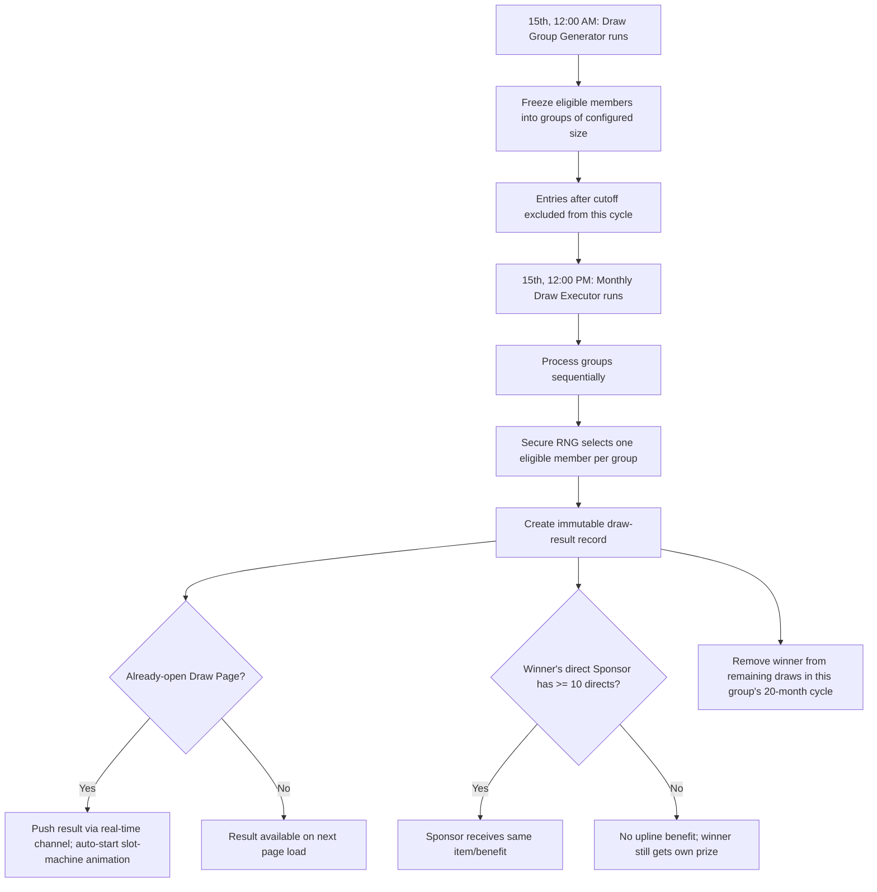

# Journeys and State Flow

## Status

- Status: Active
- Last verified: 09-09-2026
- Evidence: `GoldWave_Claude_instructions.docx` §5 (navigation), §28 (workflows), migrated here.

Business rules referenced below live in `DOMAIN_LOGIC.md`; page contents live in `INSTRUCTIONS.md`. This file only sequences the steps and decision points.

## Navigation / Entry Points

- **Public:** Registration (requires a valid sponsor/invite code) → Payment → Pending Profile completion.
- **Member:** Dashboard is the home screen after login; Directs View and Tree View are two independent navigation surfaces off the Dashboard/network menu (never merged — see `DOMAIN_LOGIC.md` §4.1–§4.2).
- **Admin/Store Owner:** Store Dashboard is the home screen; all navigation stays scoped to the assigned store.
- **Super Admin:** System Dashboard is the home screen, with access to every member's Directs View / Tree View and every store.

## Journeys

### J1 — New member: online one-time plan (₹20,000 or ₹50,000)

1. Open registration.
2. Validate sponsor code; show sponsor name.
3. Select Left/Right side.
4. Enter member details.
5. Select ₹20,000 or ₹50,000 plan.
6. Create pending order.
7. Complete online payment.
8. Verify gateway callback (idempotent).
9. Activate membership; generate Customer ID.
10. Create product benefit record.
11. Create joining event.
12. Calculate applicable Level Income (`DOMAIN_LOGIC.md` §6).
13. Add eligible pair business (`DOMAIN_LOGIC.md` §7).
14. Update directs/team/tree/wallet/reporting views.

**Failure/retry branch:** gateway callback never arrives or fails → registration stays at Payment Pending; no membership, no Customer ID, no compensation is created until a verified callback lands.

### J2 — New member: EMI plan (₹1,000×20, ₹3,000×10, ₹5,000×10)

1. Same registration flow as J1 through plan selection.
2. Create membership after the entry payment/activation policy is satisfied.
3. Generate the full EMI schedule (`DOMAIN_LOGIC.md` §5).
4. Initial eligible payment may trigger compensation per plan.
5. Each later successful installment triggers a Level Income calculation only as a payment event (never a new joining), via the Sponsor/Direct chain for Levels 1–12.
6. Pair/Reward eligibility for the EMI entry unlocks only once the plan's minimum-EMI threshold is met (₹1,000 → 6 EMIs; ₹3,000/₹5,000 → 2 EMIs) — see `DOMAIN_LOGIC.md` §7.3.

### J3 — Cash payment (registration or EMI installment)

1. Member selects Cash at registration or for an installment.
2. System creates a Cash Pending record; **no activation and no compensation yet**.
3. Admin/Super Admin verifies the physical receipt.
4. **Approve** → mark Paid, continue normal eligibility processing (membership activates / installment counts) — the activating operator is recorded.
5. **Reject/cancel** → retain audit trail; no compensation generated; member stays inactive/unpaid.

### J4 — Store purchase / repurchase

1. Store Admin creates a confirmed purchase/repurchase transaction.
2. Records member ID, item name, item weight, rate, amount; applies configured GST; generates invoice.
3. If Store Wallet is the payment source: check sufficient balance → if insufficient, **block the transaction** → if sufficient, deduct atomically.
4. Calculate Purchase/Repurchase Upline Income: member 2%, direct Sponsor 1%, Sponsor/Direct Levels 2–6 at 0.5%, Levels 7–12 at 0.25%, with duplicate-beneficiary protection (`DOMAIN_LOGIC.md` §15).
5. Create income ledger entries linked to the purchase/repurchase transaction and invoice; record the Store Wallet deduction where applicable.
6. Show invoice, Store Wallet transaction, and distribution on store/member reports; invoice can be printed or shared via WhatsApp.

### J5 — Monthly Draw cycle

Group-wise prize: first 15 months of a group's 20-month cycle use Silver prizes, final 5 months use Gold prizes, each configured per group/month by Super Admin (`DOMAIN_LOGIC.md` §8.3).

### J6 — Payout request and processing

1. Member submits a payout request (only allowed when withdrawable balance ≥ configured minimum, default ₹500).
2. Server validates balance, minimum, beneficiary/account details, and holds; creates the request (**no debit yet**).
3. Super Admin reviews monthly: approve/process, reject, or cancel.
4. On approval: choose payment mode (Cheque / GPay/UPI / Bank Transfer / in-app provider), individually or via bulk/batch.
5. On success: mark Processed, create debit ledger entry, release wallet hold.
6. On failure: mark Failed, keep balance consistent (no permanent debit), release wallet hold.

### J7 — Profile pending-fields and change request

1. After registration, member sees Complete Pending Profile (PAN, Aadhaar, Photo, Bank Details, Passbook/Cheque, Address).
2. Member submits once → fields lock.
3. Any later change → Change Request (reason + new value) → Super Admin approves (updates field) or rejects (keeps original) → member notified.

### J8 — Daily Dummy Entry generation and leader assignment

1. Daily job reads Super Admin config (count, enabled/disabled, placement mode).
2. If disabled: no records created.
3. If enabled: generate N dummy member records, mark Company Direct/Unassigned, place per configured mode (e.g. always-right).
4. Dummy entries sit in an admin assignment queue — not treated as member joinings until assigned.
5. When a real leader is ready: Super Admin selects a dummy entry, enters the leader's details → the dummy entry becomes the leader's real Customer ID/identity, retaining full audit history.
6. From then on, further daily-generated entries continue placing under that leader's Right position and behave as normal members for every calculation.

### J9 — Directs View navigation (member self-service and Super Admin lookup)

Header fixed to the logged-in member (or, for Super Admin, the member being inspected) → click a Direct card → Selected Member Card updates → that member's own directs render below → repeat recursively. Sponsor/Direct relationship only.

### J10 — Tree View navigation

Header fixed to the logged-in member (or inspected member for Super Admin) → root node = that member with Left/Right branches → click any node → it becomes the new root with its own branches → repeat recursively; zoom/pan supported. Binary Position relationship only.

## Diagram Rule

Use Mermaid only when it removes ambiguity (as with the Draw cycle above, which has multiple parallel branches and timing). Keep diagrams small and pair each with a concise textual rule; diagrams must not be the sole source of a requirement — the numbered steps and `DOMAIN_LOGIC.md` remain authoritative.
